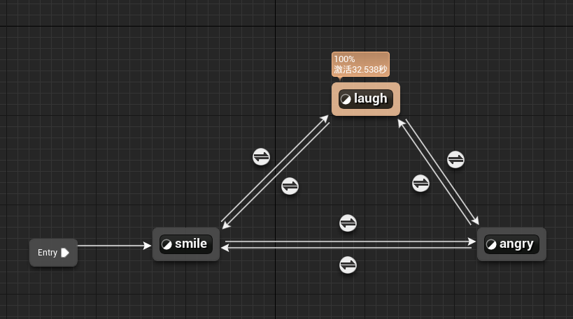
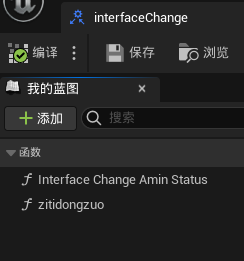
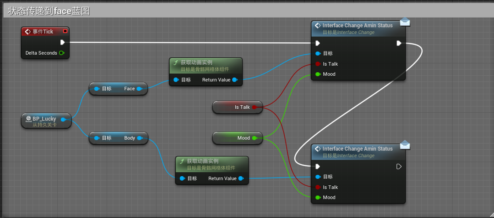

     
    
    <h1>FAY</h1>
	<h3>Fay  UE5工程</h3>

Fay（https://github.com/TheRamU/Fay）Fay是一个完整的开源项目，包含Fay控制器及数字人模型，可灵活组合出不同的应用场景：虚拟主播、现场推销货、商品导购、语音助理、远程语音助理、数字人互动、数字人面试官及心理测评、贾维斯、Her。开发人员可以利用该项目简单地构建各种类型的数字人或数字助理。该项目各模块之间耦合度非常低，包括声音来源、语音识别、情绪分析、NLP处理、情绪语音合成、语音输出和表情动作输出等模块。每个模块都可以轻松地更换。此工程是Fay配套的UE数字人。

## **一、UE引擎**

### **引擎版本：** 5.03
### **人物属性：** Metahuman
### **人物表情：** smile、laugh、angry
### **人物动作：**  Sequencer动画序列
### **人物形象：** 

工程下载地址：正在上传

windows文件下载地址：正在上传

## **二、所需插件**

 ## **三、主要通讯逻辑**

## **四、蓝图关卡**

### **状态机做表情切换** 

### **蓝图接口数据传输** 

### **face蓝图呈现人物动作和表情**

 ## **五、其他**

 + 唇形同步主要应用MetahumanSDK，启用插件需先获取APIToken
 + 工程内的人物可替换
 + 姿体动作可修改

关注公众号获取最新微信技术交流群二维码

