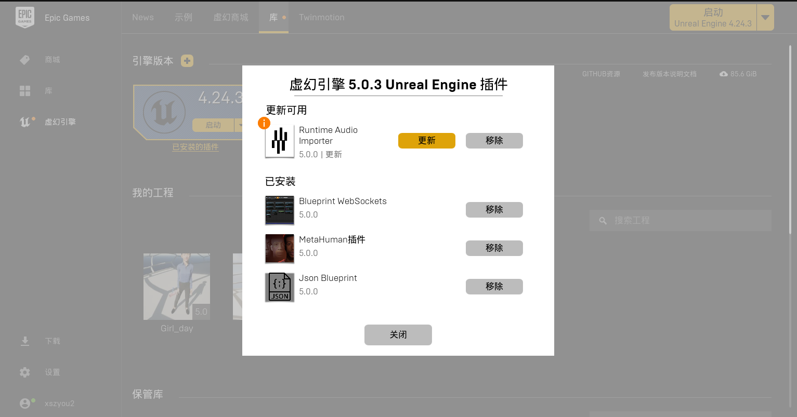
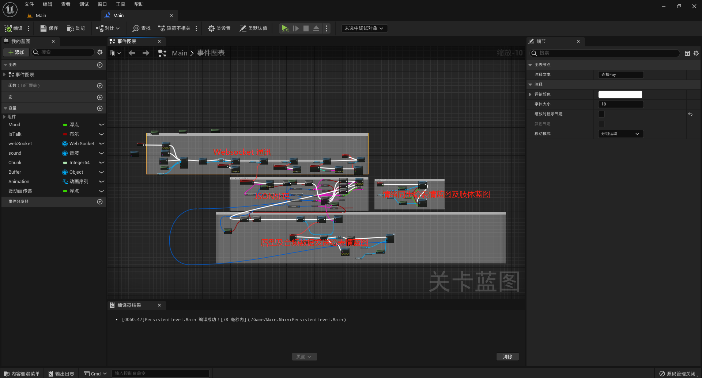
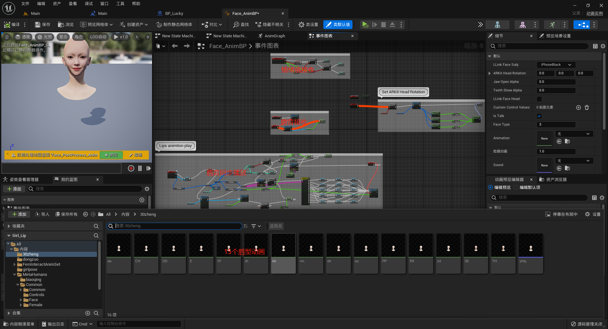
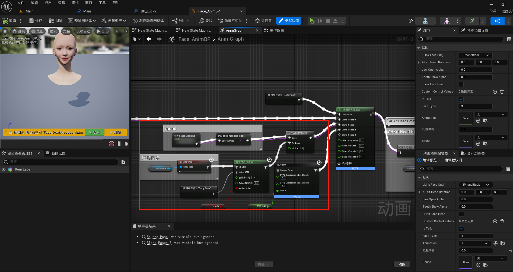

     
    
    <h1>FAY</h1>
	<h3>Fay  UE5工程(Metahuman)</h3>

（https://github.com/TheRamU/Fay）[Fay是一个完整的开源项目，包含Fay控制器及数字人模型，可灵活组合出不同的应用场景：虚拟主播、现场推销货、商品导购、语音助理、远程语音助理、数字人互动、数字人面试官及心理测评、贾维斯、Her。开发人员可以利用该项目简单地构建各种类型的数字人或数字助理。该项目各模块之间耦合度非常低，包括声音来源、语音识别、情绪分析、NLP处理、情绪语音合成、语音输出和表情动作输出等模块。每个模块都可以轻松地更换。此工程是Fay配套的UE数字人。]

## **一、UE引擎**

### **引擎版本：** 5.03
### **人物属性：** Metahuman
### **人物表情：** smile、laugh、angry
### **人物动作：**  Sequencer动画序列
### **人物形象：** 

工程下载地址链接：https://pan.baidu.com/s/1QvRwkDmqLn6kbL16xk28XA?pwd=osqf 

## **二、所需插件**

 ## **三、主要通讯逻辑**

作为websocket客户端去自动连接websocket服务器，接收如下接口数据：

[Fay/WebSocket.md at main · TheRamU/Fay (github.com)](https://github.com/TheRamU/Fay/blob/main/WebSocket.md)

## **四、关卡蓝图**

## 五、表情蓝图**

## 六、脸部合成**

 ## **七、关键技术**

 + 唇形同步应用OVRLipSync

 + 通过websocket 与Fay控制器对接（https://github.com/TheRamU/Fay）实现人机交互

 + 依据情绪变化自动切换表情

 + 关卡蓝图与表情蓝图通过蓝图接口通讯

 + 工程内的人物可替换其他Metahuman模型

 + 姿体动作可修改

   

   注：工程讲解：https://m.bilibili.com/video/BV1Zh4y1g7o7

技术交流群：关注 Fay数字人 公众号，进入 UE交流群

