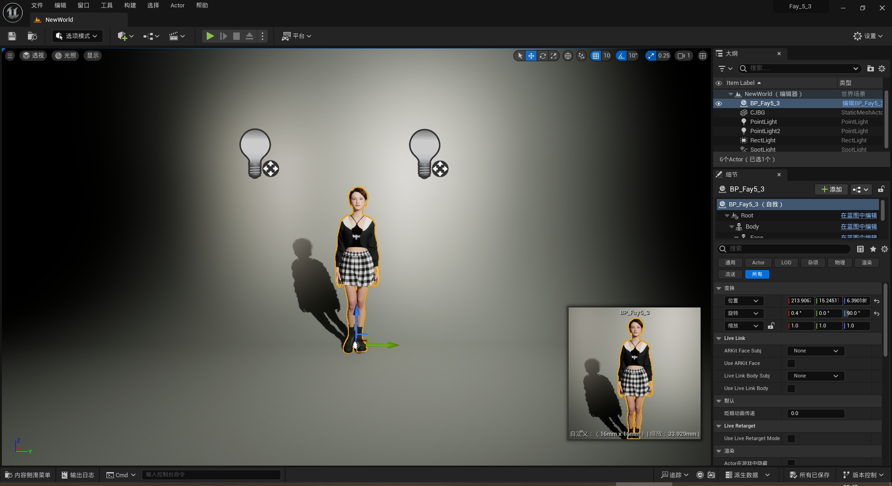
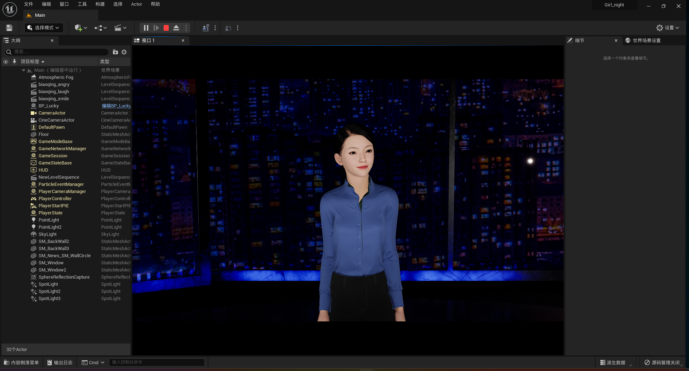
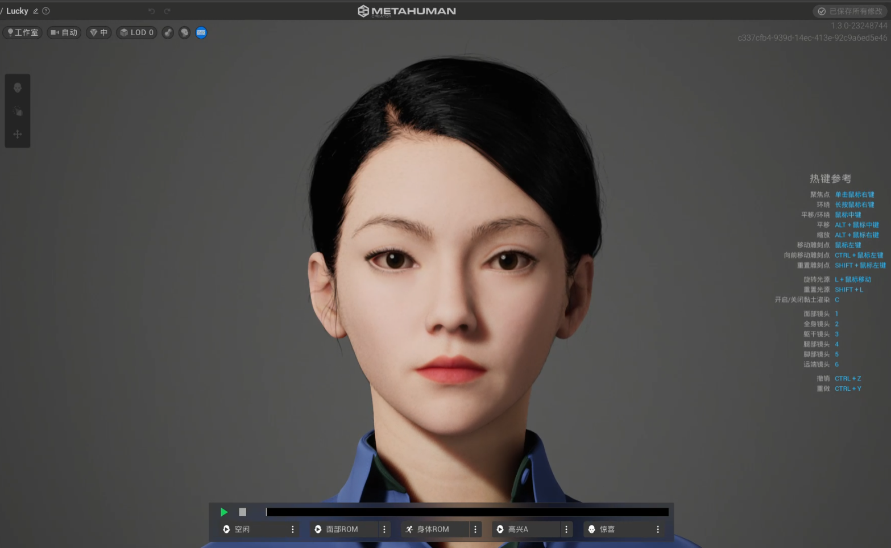
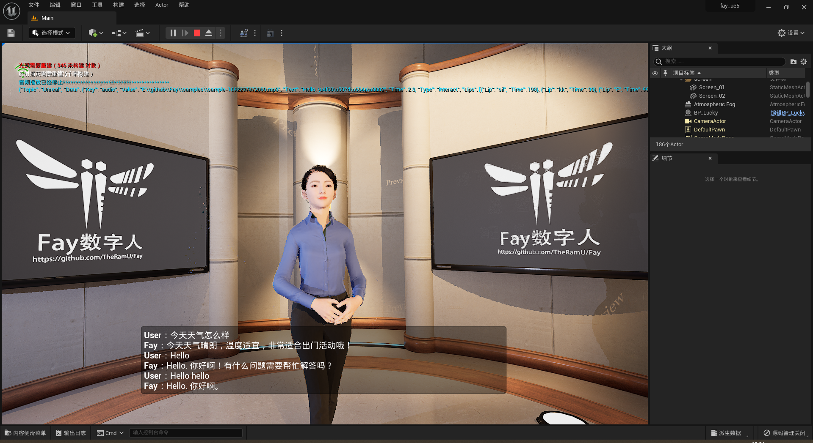
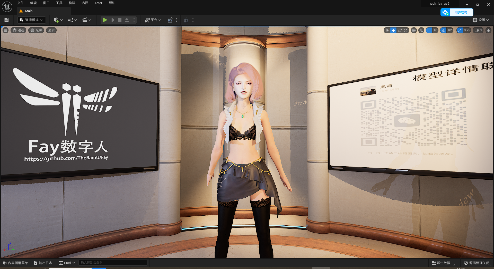
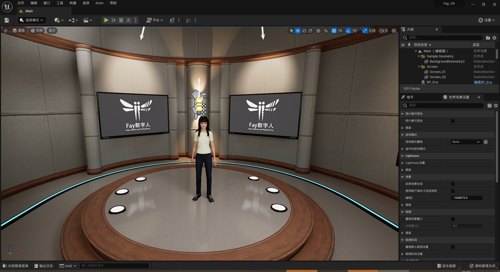
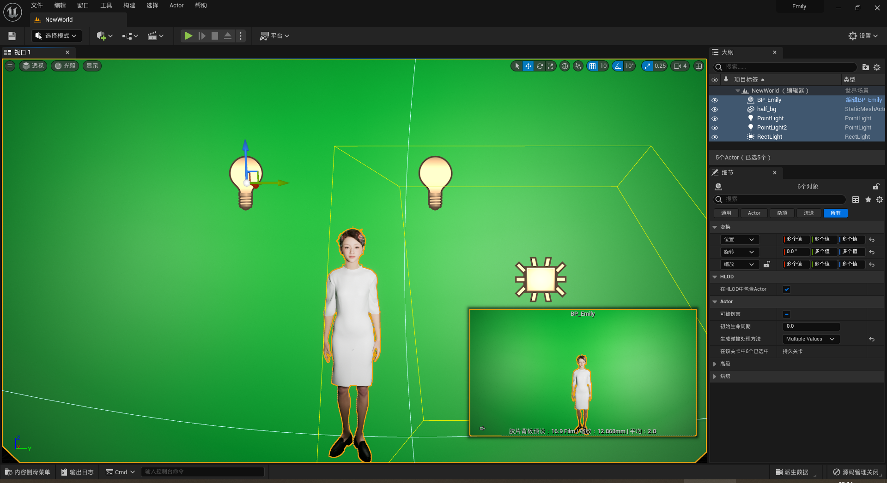

     
    
    <h1>FAY</h1>
	<h3>UE5 数字人工程(Metahuman)</h3>

[此工程是一个完整的UE数字字人开源工程，可以配合Fay数字人框架，实现各种应用场景：虚拟主播、现场推销货、商品导购、语音助理、远程语音助理、数字人互动、数字人面试官及心理测评、贾维斯、Her]（https://github.com/TheRamU/Fay）。

（加入交流群请关注公众号：fay数字人）

**同步更新工程(20240522)**

UE版本：5.3，唇型：azure ，音频：azure，ASR：azure，驱动接口：Fay及其他gpt兼容接口。

插件：AZSpeech(key在metahuman蓝图上配置)、HttpGPT(节点在metahuman蓝图上配置，可以配置到Fay所在的主机如:http://127.0.0.1:5000)

改进：全新模型、支持最新5.3引擎、使用azure全家桶、支持与Fay异地、支持网页推流、支持打包android、ios及pc客户端。

工程下载地址：https://pan.baidu.com/s/1ZzTdkjw7SQnQLVrHWowmaw?pwd=xxvr

运行包下载地址：请自行使用ue打包。

2024-05-22

1、增加文本输入框（与Fay会同步消息），方便网页端和移动端操作。

效果：[Fay新5.3UE工程效果_哔哩哔哩_bilibili](https://www.bilibili.com/video/BV1kr421j7Gv/)

2024-05-15

1、增加语音按钮，方便网页端和移动端操作。

## **一、使用逻辑**

1、[如何进行抖音直播](https://www.bilibili.com/video/BV1r3411Z7St/?spm_id_from=333.999.0.0&vd_source=1364af6ac23a05600acd8f8415936944)

2、[如何进行B站直播](https://www.bilibili.com/video/BV14h4y1N716/?spm_id_from=333.999.0.0&vd_source=1364af6ac23a05600acd8f8415936944)

3、[如何进行人机交互](https://blog.csdn.net/aa84758481/article/details/132204938?spm=1001.2014.3001.5502)

4、[OVRLipsync唇形算法代码](https://pan.baidu.com/s/1ph8mzpZ3aYMI8HFa8-6prA?pwd=tin1)

## **二、UE工程说明**

1、[UE基本操作及数字人工程模块组成](https://blog.csdn.net/aa84758481/article/details/132204938?spm=1001.2014.3001.5502)

2、[UE数字人工程运行逻辑及程序逻辑](https://blog.csdn.net/aa84758481/article/details/132335739?spm=1001.2014.3001.5502)

 ## **三、历史版本**

**1、UE4.27 男模陈升**

UE版本：4.27，唇型：固定动画 ，驱动接口：接收音频文件路径、接收情绪值

[下载工程](https://pan.baidu.com/s/1cAa7IrzjyHMv__wAx_0WsA?pwd=645g)

[Windows一键运行包](https://pan.baidu.com/s/1CsJ647uV5rS2NjQH3QT0Iw?pwd=s9s8)

**2、UE5.03 Girl_night**

UE版本：5.0.3，唇型：Metahuman SDK ，驱动接口：接收文本、接收情绪值

[下载工程](https://pan.baidu.com/s/1frJA1ChdpPlmN4G_KWm4Rg?pwd=crzj)

**3、UE5.03 本地唇形Girl_lip**

UE版本：5.0.3，唇型：视音素动画 ，驱动接口：接收音频文件路径、接音音频视音素序列、接收情绪值

[下载工程](https://pan.baidu.com/s/1S_0LZE2X37pVNWEvc4GiLA?pwd=ehbf )

**4、UE5.03 8月版**

UE版本：5.0.3，唇型：视音素动画 ，驱动接口：接收音频文件路径、接音音频视音素序列、接收情绪值、接收控制台日志、接收用户问题文本、回复说话完成状态

[下载工程](https://pan.baidu.com/s/1TtZD0jrG5xRqAMtydjBbew?pwd=mryc)

[视频说明](https://www.bilibili.com/video/BV1mz4y1M7pq/)

**5、9月版**

UE版本：5.0.3，唇型：视音素BS ，驱动接口：接收音频文件路径、接音音频视音素序列、接收情绪值、接收控制台日志、接收用户问题文本、回复说话完成状态，改进：新模型、使用[唇形BS](./唇形bs.docx)

工程下载地址：https://pan.baidu.com/s/10ASvGYQMpSrZV8OtXCmDdw?pwd=plz1 

唇型BS说明：https://www.bilibili.com/video/BV1G94y1V75W

**6、10月版**

UE版本：5.0.3，唇型：优化视音素 ，驱动接口：接收音频文件路径、接音音频视音素序列、接收情绪值、接收控制台日志、接收用户问题文本、回复说话完成状态，

改进：全新模型、[提供VR运行包（视频）](https://b23.tv/1W0sJZv)、优化唇形、改进web socket 状态显示逻辑、降低性能资源消耗。

工程下载地址：链接：https://pan.baidu.com/s/1Fal4ZvL-pL5g_bdsWJIcaw?pwd=4bz8  

VR运行包下载地址(含普通运行包)：https://pan.baidu.com/s/1m7a-METJFaFmwyRKwDeTRQ?pwd=ztmh 

VR效果：https://b23.tv/1W0sJZv

**7、emily**

UE版本：5.0.3，唇型：视音素 ，驱动接口：接收音频文件路径、接音音频视音素序列、接收情绪值、接收控制台日志、接收用户问题文本、回复说话完成状态，

改进：全新模型、提供站姿绿幕包、支持打断功能。

工程下载地址：https://pan.baidu.com/s/1lUPK5G0-BLwfgu3LrfulCQ?pwd=wesr 

运行包下载地址：https://pan.baidu.com/s/1VaWmA8_0s8wmlaWBCUihog?pwd=02dx 

